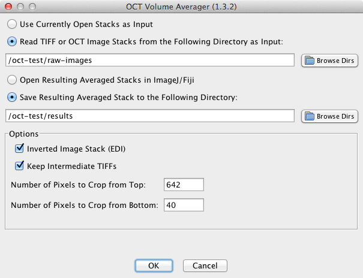

# Introduction

The OCT Volume Averager plugin registers and averages optical coherence
tomography (OCT) volume datasets that are acquired by repeated scanning
from a single eye to improve the detection of fine detail. The plugin relies
on the TurboReg and StackReg plugins to perform image registration. OCT
Volume Averager is most useful for efficient processing of input data that
are organized to include repeated scans from one or more eyes in a single
folder. However, it also accepts data opened in ImageJ/Fiji. Currently the
plugin has been tested on OCT volumes acquired with a Bioptigen Envisu R2200
UHR-SDOIS instrument and includes the Bioptigen OCT Reader plugin for ImageJ
to convert Bioptigen \*.oct files to \*.tif format. OCT Volume Averager may be
applied in principle to repeated OCT volume scans obtained in \*.tif format
from other instruments.

The TurboReg and StackReg plugins were developed by P. Thévenaz and
coworkers.  See the following websites for more information: 
[http://bigwww.epfl.ch/thevenaz/turboreg/](http://bigwww.epfl.ch/thevenaz/turboreg/) 
[http://bigwww.epfl.ch/thevenaz/stackreg/](http://bigwww.epfl.ch/thevenaz/turboreg/) 

The OCT_Reader plugin for ImageJ was developed by Bioptigen: 
Copyright 2010 Bioptigen, Inc. 
Author: Bradley Bower 

All other code was developed at The Jackson Laboratory: 
Copyright 2013-2014 The Jackson Laboratory. 
Authors: Keith Sheppard, Mei Xiao and Mark Krebs 

## Installation

In order to run the OCT Volume Averager plugin you need to have either
Fiji or ImageJ installed. Additionally this plugin depends on the
[TurboReg](http://bigwww.epfl.ch/thevenaz/turboreg/) and
[StackReg](http://bigwww.epfl.ch/thevenaz/stackreg/) plugins.
If you are using Fiji these two plugins should be available by default but if
you are using ImageJ you will have to install these plugins yourself.

Once you have these prerequisites installed you can install the OCT Volume
Averager plugin by placing the `OCT_Vol_Avg_Plugin.jar` jar file in ImageJ/Fiji's
plugin directory. As an example if Fiji is installed in the Applications folder
on Mac OS X you will find the plugins folder at `/Applications/Fiji.app/plugins`.
After the plugin is installed you should see a new OCT Volume Averager menu item
under Fiji/ImageJ's Plugins menu.

## OCT Input Data Format

The OCT image stacks to be averaged can either be \*.tiff files, \*.oct files or image
stacks that are opened in ImageJ/Fiji. In each case all of the image stacks
to be averaged must have the same dimensions (height, width and size). They must
also be grayscale images with a bit depth of 8 or 16.

The image averager will attempt to infer replicate groups which need to be
registered and averaged together based on file naming
conventions used in the images files generated by Bioptigen. The following
regular expression is used to perform this grouping: `^(.+_O[DS])_V_.+.OCT$`.
If your files do not follow this convention the software will still work, but
in this case you must separate all image replicate groups into thier own
directories and register each replicate group one at a time.

## The OCT Volume Averager's User Interface

The following list describes the function of all of the User Interface
components:

* Use Currently Open Stacks as Input: Selecting this option indicates that the registration and averaging should be
  performed on the stacks that are currently open in ImageJ/Fiji rather than
  looking for this images on disk.
* Read \*.tiff files From the Following Directory as Input:
  Selecting this option allows you to select which directory the input \*.tiff files will
  be read from.  You can use the Browse Dirs button to navigate the file system.
* Open Resulting Averaged Stacks in ImageJ/Fiji:
  Selecting this option results in the registered and averaged image stacks being
  opened in ImageJ/Fiji after averaging is complete.
* Save Resulting Averaged Stack to the Following Directory: this will result
  in the registered and averaged images being saved to the given directory as \*.tiff
  files rather than being opened directly in ImageJ/Fiji
* Inverted Image Stack (EDI): indicates that the image stacks are inverted which
  is also known as Enhanced Depth Imaging (EDI)
* Keep Intermediate \*.tiff Files: selecting this option causes the image stacks to be
  saved to your output directory after cropping the specified pixels from the
  top and the bottom of the image stack. This option could be especially useful
  when working with the \*.oct image format since the intermediate images are
  rendered as \*.tiff files.
* Number of Pixels to Crop from Top/Bottom: results in all of the input stacks having
  the given number of pixels cropped from the top/bottom of the stack before any
  registration or averaging is performed.
